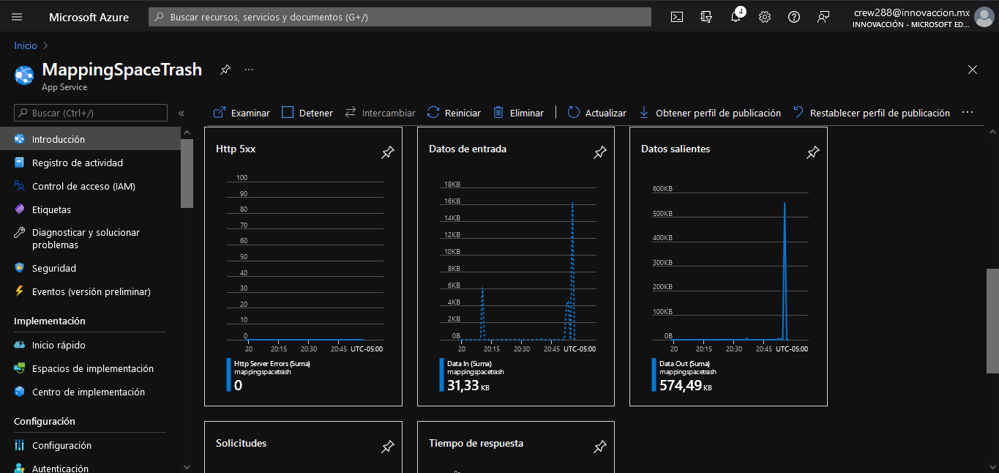
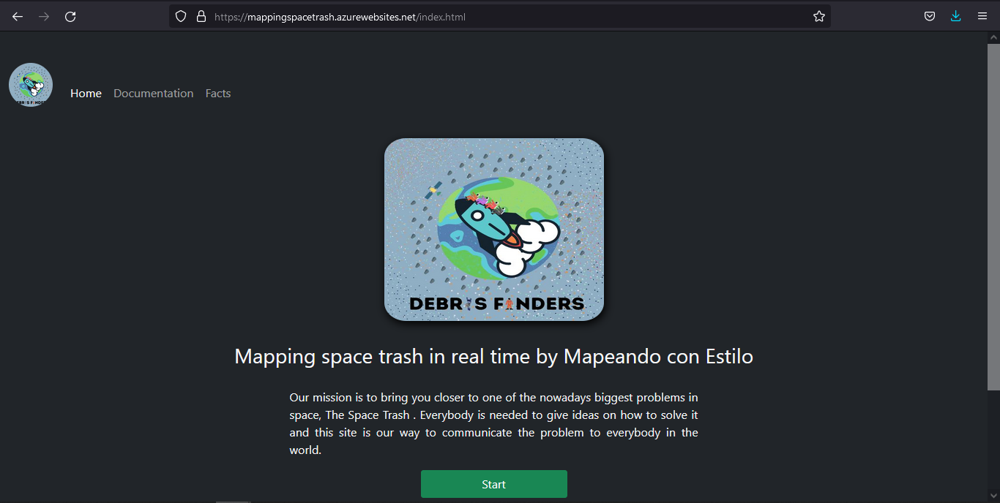
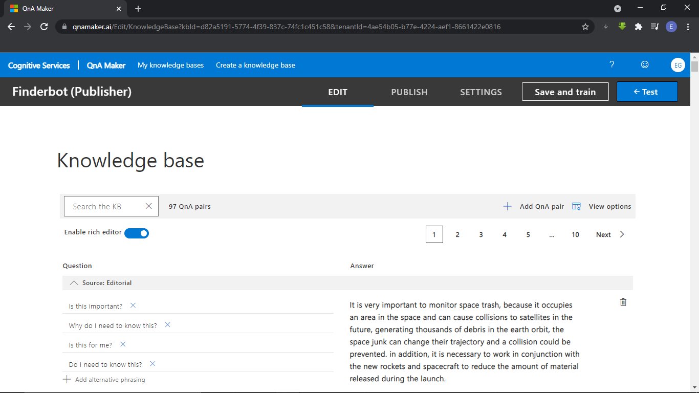
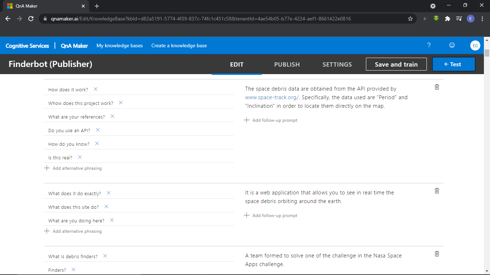
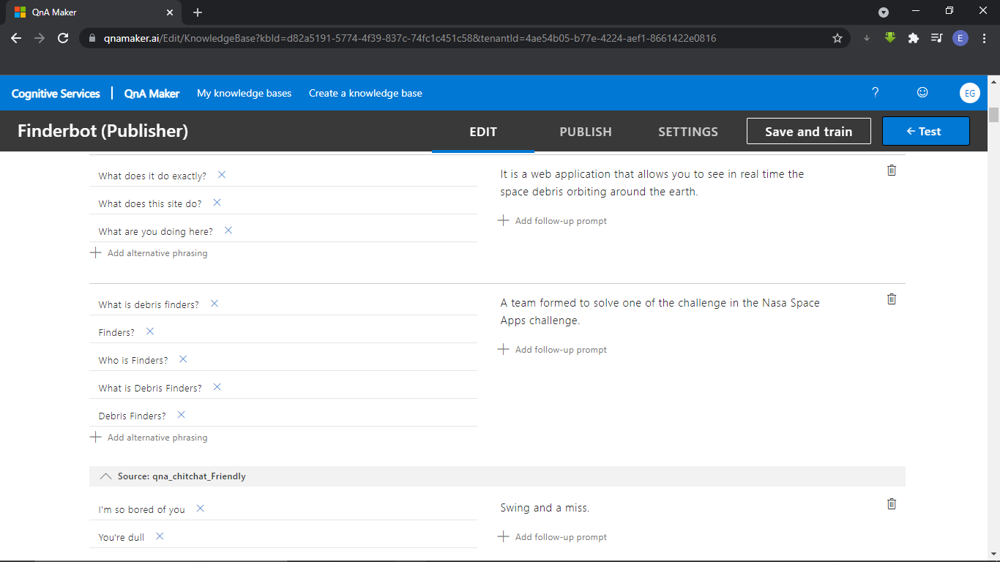
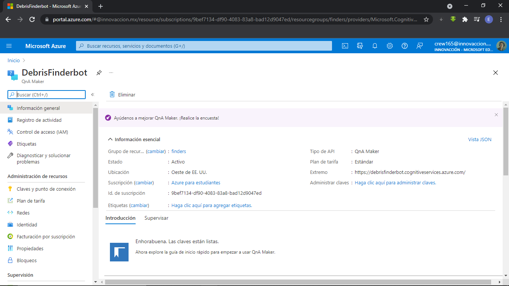
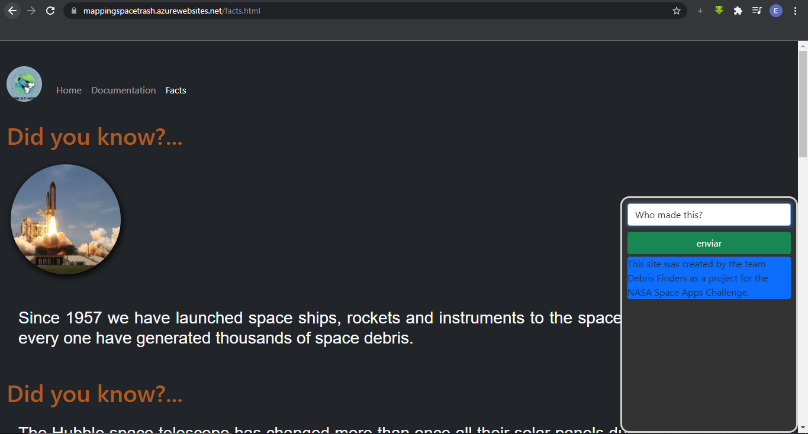
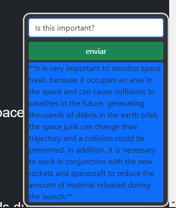

## Mapping space trash in real time
[Demo del proyecto](https://mapping-space-trash.vercel.app/)

## Azure App services

## Sitio web

## Azure Bot Service

## Bot implementado en la página webkit

